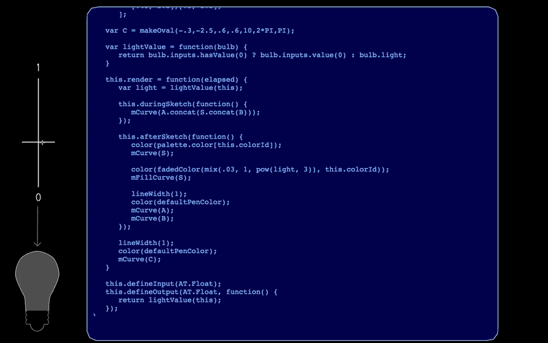

# Chalktalk

**Chalktalk** is a digital presentation and communication language 
in development at [New York University's Future Reality Lab](https://frl.nyu.edu/).
Using a blackboard-like interface, it allows a presenter to create and interact
with animated digital sketches in order to demonstrate ideas and concepts in the context
of a live presentation or conversation.

Sketches can display animations and graphics in 2D and 3D…

…link together to demonstrate complex logical connections and behaviors…

…and even be coded live from within Chalktalk itself.

A growing library of sketches--from creatures to math and physics objects--is available,
and Chalktalk continues to evolve.

## Installation and Usage

Installation instructions can be found [in the wiki](https://github.com/kenperlin/chalktalk/wiki/Installation-and-Running). A brief tutorial on how to use the system [can be found there as well](https://github.com/kenperlin/chalktalk/wiki/Introduction-to-Chalktalk).

## What we need and how to contribute

### What to Contribute:

Contributions to the core codebase and sketch library are welcome. Current development for Chalktalk will foucs on building out “domains of knowledge” which will essentially be modules that contain a set of sketches for a specific use case or application (e.g. modules for mathematics, architecture, audio engineering/ sound design, VR, art, computer graphics,  chemistry,  cooking, etc...). With the addition of each new module, Chalktalk will essentially “speak” the language associated with that knowledge domain. 

There will soon be updates that will enable a tagging system where each sketch will be associated with one or more tags (modules) so new PR’s with sketches to be added should indicate which knowledge domain a sketch should be associated with 
(the domain doesn’t have to currently exist within Chalktalk). The vision for Chalktalk is to make it into an educational platform that is capable of visually communicating knowledge in any subject, so new contributions should be made with that in mind.  

### How to Contribute:

Formatting and Style:
- 3 space indents, terminate statements with semicolons (C-like style)
           - C++-like brace style:
    e.g.

      if (x) {
      } // NO HANGING ELSE IF / ELSE HERE
      else {
      }
    
- Always use braces with if/else/while/etc.
- use `let` and `const` wherever possible, (not a restriction, just a loose recommendation)

    - use strict mode ( `"use strict"` ) in all source files except for sketches. Note that sketches automatically use strict by default via the sketch loading code.

Contributors need to suggest core changes by creating issues

To create your own sketch, create a new .js file (nameOfMySketch.js) or copy a template (from sketch_templates) into the sketches directory. 

In your file, change the value of `this.label` and begin customizing your new sketch.

[Further information on sketch creation can be found in the wiki](https://github.com/kenperlin/chalktalk/wiki/Creating-a-Sketch).

## License 
MIT

