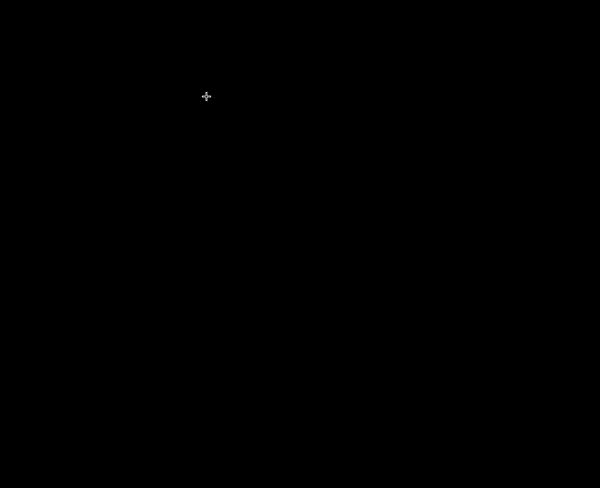
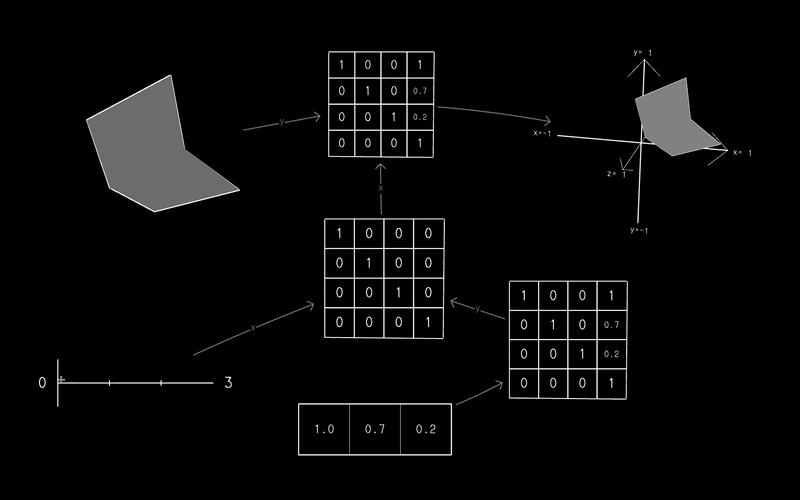

# Chalktalk

**Chalktalk** is a digital presentation and communication language 
in development at [New York University's Future Reality Lab](https://frl.nyu.edu/).
Using a blackboard-like interface, it allows a presenter to create and interact
with animated digital sketches in order to demonstrate ideas and concepts in the context
of a live presentation or conversation.

Sketches can display animations and graphics in 2D and 3D…

…link together to demonstrate complex logical connections and behaviors…

…and even be coded live from within Chalktalk itself.

A growing library of sketches--from creatures to math and physics objects--is available,
and Chalktalk continues to evolve.

## Installation and Usage

Installation instructions can be found [in the wiki](https://github.com/kenperlin/chalktalk/wiki/Installation-and-Running). A brief tutorial on how to use the system [can be found there as well](https://github.com/kenperlin/chalktalk/wiki/Introduction-to-Chalktalk).

## What we need and how to contribute

### Contributing:

Contributions to the sketch library and sketchlibs are welcome. 
Place reusable code in sketchlibs.
Suggest improvements or updates to the core codebase by submitting an issue.

Chalktalk is an educational platform and performance language capable of visually communicating knowledge in any subject, so new contributions should be made with that in mind.  

Current development for Chalktalk content will focus on building sketches that belong to certain domains of knowledge. (e.g. mathematics, architecture, audio engineering, sound design, VR, art, computer graphics, computer science, chemistry, cooking, etc.) Sketches should interact with each other as part of a larger ecosystem.
We encourage creativity and are excited to see contributions going beyond the current library.

Note: a soon-to-be-enabled update will implement a sketch tagging system where each sketch is associated with one or more tags (attributes / descriptions), so new pull requests with sketches to be added should use `this.tag = "tagname"` or `this.tags = ["tagname1", "tagname2"]` within the function body of a sketch file (similar to `this.label` and `this.labels`). Tag names should be general enough to apply to multiple sketches.

### How to Contribute:

Formatting and Style:
- 3 space indents, terminate statements with semicolons,
  best to use braces for if/else/while/etc. for clarity 
    e.g.

      if (x) {
      } // else goes below this brace
      else {
      }
      
      // one-liner if-statement body, 
      // use braces even if unecessary
      // so future changes are less bug-prone
      // and easier to make
      if (y) {
         doSomething();
      }
    
- use `let` and `const` instead of `var` wherever possible, (not a restriction, just a loose recommendation)

- specify strict mode ( `"use strict"` ) at the top of all source files except for sketches. Note that sketches automatically use strict by default via the sketch loading code.

To create your own sketch, create a new .js file (nameOfMySketch.js) or copy a template (from sketch_templates) into the sketches directory. 

In your file, change the value of `this.label` and begin customizing your new sketch.

[Further information on sketch creation can be found in the wiki](https://github.com/kenperlin/chalktalk/wiki/Creating-a-Sketch).

## License 
MIT
